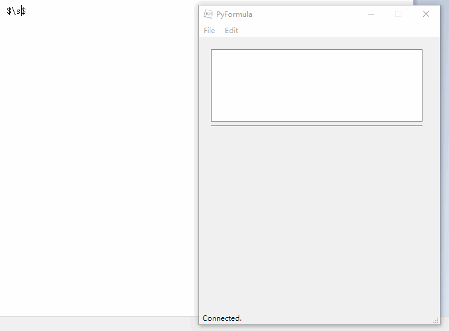

## Functionalities

- Render LaTeX formulae in real time (using online APIs)
- Listen to the clipboard and replace each `$$` formula you copied with the corresponding image
- Drag-and-drop

(Network connection is required)

## How to install

1. Download [the release](https://github.com/panda2134/PyFormula/releases/)
2. Run `PyFormula.exe`，no installation needed.

## How to use

- Type the formula in the input box, and see the output.
- Drag the formula to where you want it to be.
- Type the formula anywhere, copy it into clipboard, and paste the rendered version out (as shown above).

---

**License: GNU GPLv3**